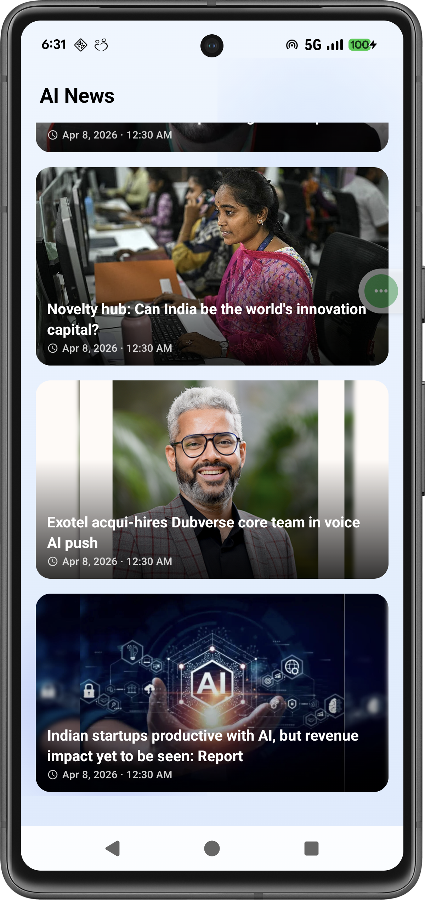
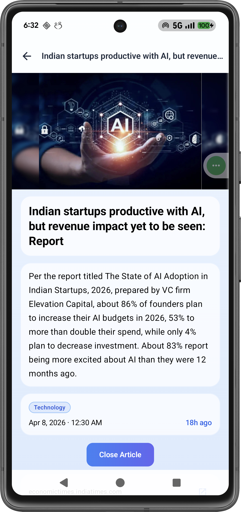

# AINewsApp

A clean, modern Android news reader app built with Kotlin and Jetpack Compose. Fetches AI-related news from the [NewsData.io](https://newsdata.io) API and presents them in a polished, Material 3 UI.
> *Built as a personal practice project + using [Claude Code](https://claude.ai/code).*
## Screens

|               Feed               |                Detail                |                In-app Reader                 |                External Browser                |
|:--------------------------------:|:------------------------------------:|:--------------------------------------------:|:----------------------------------------------:|
|  |  |  |  |

## Features

- **News Feed** — Browse the latest articles with thumbnails, titles, and previews
- **Article Detail** — Full article view with category pills, publication date, and relative timestamps
- **In-app Reader** — Read articles via an embedded WebView or open in an external browser
- **Offline Fallback** — Sample articles shown when the network is unavailable
- **Smooth UX** — Loading states, animated transitions, and a gradient glass-card design

## Tech Stack

| Layer | Technology |
|---|---|
| Language | Kotlin |
| UI | Jetpack Compose + Material 3 |
| Architecture | MVVM + Clean Architecture |
| DI | Hilt |
| Navigation | Navigation 3 (nav3) |
| Networking | Retrofit + OkHttp + kotlinx.serialization |
| Image Loading | Coil |
| Async | Coroutines + Flow |

## Architecture

```
app/
├── data/
│   ├── remote/         # API service, DTOs, mappers
│   └── repository/     # Repository implementations
├── di/                 # Hilt modules
├── domain/
│   ├── model/          # Domain models
│   ├── repository/     # Repository interfaces
│   └── usecase/        # Use cases
└── presentation/
    ├── common/         # Shared composables
    ├── navigation/     # NavHost + routes
    └── ui/
        ├── feed/       # Feed screen + ViewModel
        └── detail/     # Detail screen
```

## Getting Started

1. Clone the repo
2. Get a free API key from [newsdata.io](https://newsdata.io)
3. Add your key to `local.properties`:
   ```
   NEWS_API_KEY=your_key_here
   ```
4. Build and run on an emulator or device (min SDK 24)

## Future Enhancements

- **Pull-to-refresh** — Swipe down on the feed to fetch the latest articles on demand
- **Pagination** — Infinite scroll with page-based loading to browse more articles beyond the initial fetch
- **Local cache** — Store fetched articles in a Room database so the feed loads instantly and works fully offline; invalidate stale cache on refresh

---
